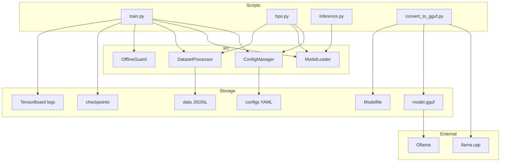
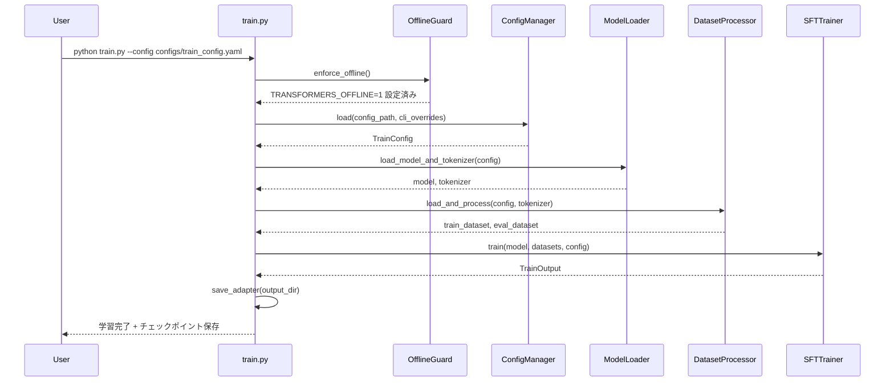
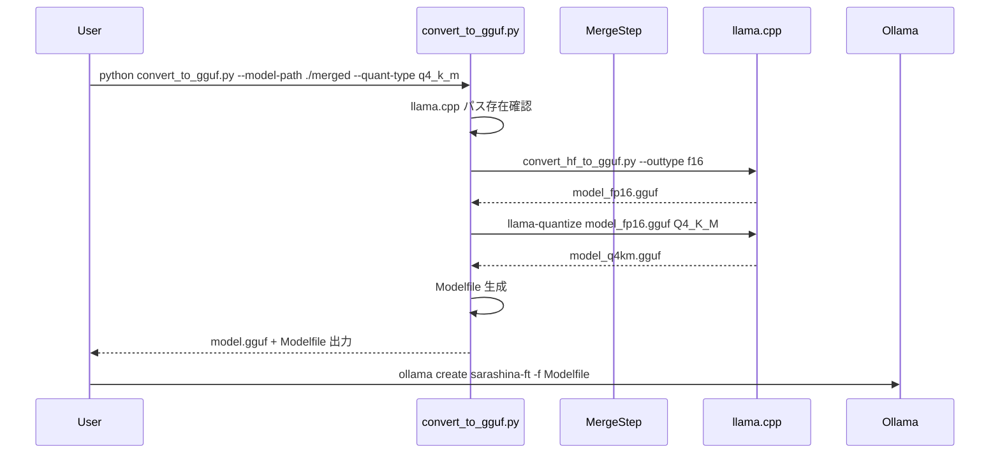
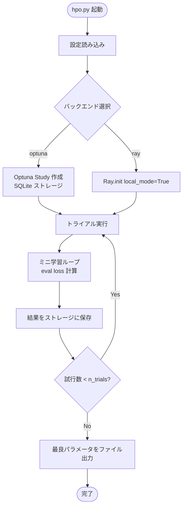

# 技術設計書: sarashina-finetune

## 概要

本設計は、日本語 SLM「sarashina-2.2:3b」を対象とした LoRA ベースのファインチューニング**学習用テンプレート**のアーキテクチャを定義する。個人の学習目的を想定しており、データ準備・学習・ハイパーパラメータ最適化・可視化・モデル変換の各フェーズを体験できる実践的なリポジトリ構成を提供する。

**ユーザー**: データサイエンティスト（個人学習目的）が、コンシューマグレード GPU（VRAM 24GB 以下）を搭載した **完全オフライン環境**でファインチューニングの全工程を実行する。

**インパクト**: 新規リポジトリとして構築し、モデルロード・データ前処理・PEFT/LoRA 学習・GGUF 変換・Ollama デプロイまでの一貫したワークフローを提供する。

### ゴール

- 完全オフライン環境（ネットワーク不要）での LoRA / QLoRA ファインチューニングの実現
- 設定ファイル（YAML）によるハイパーパラメータの一元管理と再現性の確保
- Optuna / Ray Tune を用いたハイパーパラメータ最適化（HPO）の提供
- TensorBoard によるオフライン学習モニタリングの実現
- llama.cpp 経由での GGUF 変換と Ollama デプロイフローの提供
- 動作確認用の日本語ダミーデータセットの提供

### 非ゴール

- 本番推論サービス・API サーバーの構築
- マルチノード分散学習（シングルノード前提）
- HuggingFace Hub へのモデルアップロード自動化
- CI/CD パイプラインの整備
- Web UI やダッシュボードの提供

---

## アーキテクチャ

### アーキテクチャパターンと境界マップ

**採用パターン**: 機能別モジュール分割（`src/` コアロジック + `scripts/` エントリポイント）

- `src/` に再利用可能なコアロジックを配置し、各 script から呼び出す
- オフライン制約（環境変数の強制設定）は `src/utils/offline.py` に集約
- 設定管理を `src/training/config.py` に一元化し、全コンポーネントが共有



**アーキテクチャ統合**:
- 選択パターン: 機能別モジュール分割（再利用性・テスト容易性のバランス）
- 境界: `src/` はロジック、`scripts/` はオーケストレーション
- オフライン保証: `OfflineGuard` が起動直後に環境変数を強制設定
- ステアリング準拠: 学習テンプレートとして必要十分な複雑度に留める

### テクノロジースタック

| レイヤー | 採用技術 / バージョン | 本機能での役割 | 備考 |
|---------|----------------------|---------------|------|
| Python ランタイム | Python 3.10+ | 全スクリプト実行基盤 | |
| 学習フレームワーク | `transformers` 4.40+, `trl` 1.0+ | SFTTrainer による学習ループ | `SFTTrainer` + `SFTConfig` を使用 |
| PEFT / LoRA | `peft` 0.11+ | LoRA アダプター管理・マージ | `LoraConfig`, `get_peft_model()` |
| 量子化 | `bitsandbytes` 0.43+ | QLoRA（4-bit 量子化）オプション | `BitsAndBytesConfig` |
| HPO | `optuna` 3.6+（デフォルト）, `ray[tune]` 2.x（オプション） | ハイパーパラメータ自動探索 | Optuna は SQLite 使用 |
| 可視化 | `tensorboard` 2.16+ | 学習ログのオフライン可視化 | `report_to=["tensorboard"]` |
| GGUF 変換 | llama.cpp（事前ビルド済みバイナリ） | HF モデル → GGUF 変換 | subprocess 経由で呼び出し |
| データ形式 | JSON Lines（`.jsonl`） | 学習・評価データセット | |
| 設定管理 | YAML（`PyYAML`）+ argparse | ハイパーパラメータ管理 | CLI が設定ファイルを上書き |
| ストレージ | ローカルファイルシステム, SQLite | チェックポイント, HPO ストレージ | |

拡張調査の詳細（バージョン比較・ベンチマーク）は `research.md` を参照。

---

## システムフロー

### 学習パイプライン全体フロー



### GGUF 変換フロー



### HPO フロー



---

## 要件トレーサビリティ

| 要件 | 概要 | コンポーネント | インターフェース | フロー |
|-----|------|--------------|----------------|--------|
| 1.1 | ローカルパスからのモデルロード | ModelLoader | `load_model_and_tokenizer()` | 学習パイプライン |
| 1.2 | パス不正時のエラー処理 | ModelLoader | — | — |
| 1.3 | `trust_remote_code=True` の強制 | ModelLoader | — | — |
| 1.4 | オフライン環境変数の強制 | OfflineGuard | `enforce_offline()` | 全スクリプト共通 |
| 1.5 | 外部 URL 接続の防止 | OfflineGuard | — | — |
| 2.1 | JSONL ファイル読み込み | DatasetProcessor | `load_dataset()` | 学習パイプライン |
| 2.2 | チャットテンプレート適用 | DatasetProcessor | `format_sample()` | — |
| 2.3 | max_length トランケート | DatasetProcessor | — | — |
| 2.4 | 必須フィールド欠落時のスキップ | DatasetProcessor | — | — |
| 2.5 | 検証セット損失の計算 | SFTTrainer（trl） | — | 学習パイプライン |
| 3.1 | LoraConfig パラメータ設定 | ModelLoader | `apply_lora()` | — |
| 3.2 | QLoRA オプション | ModelLoader | — | — |
| 3.3 | ベースモデル凍結 | ModelLoader | — | — |
| 3.4 | SFTTrainer による学習 | FineTuner（train.py） | — | 学習パイプライン |
| 3.5 | GPU 自動利用 / CPU フォールバック | ModelLoader | — | — |
| 4.1 | YAML/JSON 設定ファイル読み込み | ConfigManager | `load()` | 全スクリプト共通 |
| 4.2 | CLI 引数優先 | ConfigManager | — | — |
| 4.3 | gradient_checkpointing オプション | ConfigManager | — | — |
| 4.4 | 設定のログ保存 | ConfigManager | `save_snapshot()` | — |
| 5.1 | LoRA アダプター保存 | FineTuner（train.py） | — | 学習パイプライン |
| 5.2 | `PeftModel.save_pretrained()` | FineTuner（train.py） | — | — |
| 5.3 | merge_and_unload() による完全モデル保存 | FineTuner（train.py） | — | — |
| 5.4 | 出力ディレクトリ自動作成 | FineTuner（train.py） | — | — |
| 6.1 | convert_hf_to_gguf.py 呼び出し | GGUFConverter | `convert()` | GGUF 変換フロー |
| 6.2 | 量子化タイプ引数 | GGUFConverter | — | — |
| 6.3 | GGUF ファイル出力 | GGUFConverter | — | — |
| 6.4 | Modelfile 自動生成 | GGUFConverter | `generate_modelfile()` | — |
| 6.5 | ollama create 手順のドキュメント | README | — | — |
| 6.6 | llama.cpp 不在時のエラー | GGUFConverter | — | — |
| 7.1 | ダミーデータセットファイル | data/ | — | — |
| 7.2 | JSONL 形式・日本語 20 件以上 | data/ | — | — |
| 7.3 | 複数カテゴリのサンプル | data/ | — | — |
| 7.4 | ダミーデータでの学習完走 | 全パイプライン | — | 学習パイプライン |
| 7.5 | data/README.md | data/README.md | — | — |
| 8.1 | Optuna / Ray Tune 切り替え | HPORunner | `run()` | HPO フロー |
| 8.2 | 探索空間定義 | HPORunner | `define_search_space()` | — |
| 8.3 | 評価指標として eval loss 使用 | HPORunner | — | — |
| 8.4 | 最良パラメータのファイル出力 | HPORunner | — | — |
| 8.5 | Ray Tune 並列探索 | HPORunner | — | — |
| 8.6 | n_trials 引数 | HPORunner | — | — |
| 8.7 | Optuna SQLite ストレージ | HPORunner | — | — |
| 8.8 | Ray Tune ローカル単体動作 | HPORunner | — | — |
| 9.1 | TensorBoard ログ出力（runs/） | FineTuner（train.py） | — | 学習パイプライン |
| 9.2 | train/eval loss・学習率のログ | FineTuner（train.py） | — | — |
| 9.3 | grad_norm のログ | FineTuner（train.py） | — | — |
| 9.4 | `report_to="tensorboard"` 設定 | ConfigManager | — | — |
| 9.5 | TensorBoard 起動手順のドキュメント | README | — | — |
| 9.6 | TensorBoard オフライン動作 | OfflineGuard | — | — |
| 9.7 | W&B オフラインモード設定 | OfflineGuard | — | — |
| 10.1 | 学習後の推論デモ | FineTuner（train.py） | — | — |
| 10.2 | アダプター読み込みと推論 | InferenceRunner | `run_inference()` | — |
| 10.3 | 生成パラメータの引数指定 | InferenceRunner | — | — |
| 11.1 | 事前取得手順のドキュメント | README | — | — |
| 11.2 | requirements.txt（バージョン固定） | requirements.txt | — | — |
| 11.3 | オフライン pip install 手順 | README | — | — |
| 11.4 | Ollama オフラインインストール手順 | README | — | — |
| 11.5 | ネットワーク接続発生時の明示的エラー | OfflineGuard | — | — |
| 11.6 | オフライン用ファイルチェックリスト | README | — | — |

---

## コンポーネントとインターフェース

### コンポーネントサマリー

| コンポーネント | レイヤー | 役割 | 要件カバレッジ | 主要依存（優先度） | 契約 |
|--------------|---------|------|--------------|-------------------|------|
| OfflineGuard | src/utils | 環境変数強制・外部接続防止 | 1.4, 1.5, 9.6, 9.7, 11.5 | なし | サービス |
| ConfigManager | src/training | YAML 設定読み込み・CLI 優先・スナップショット保存 | 4.1〜4.4, 9.4 | PyYAML, argparse | サービス |
| ModelLoader | src/model | ローカルモデル/トークナイザーロード・LoRA/QLoRA 適用 | 1.1〜1.3, 3.1〜3.3, 3.5 | transformers, peft, bitsandbytes | サービス |
| DatasetProcessor | src/data | JSONL 読み込み・チャットテンプレート適用・トランケート | 2.1〜2.5 | transformers, datasets | サービス |
| FineTuner | scripts/train.py | 学習ループのオーケストレーション・チェックポイント管理 | 3.4, 5.1〜5.4, 9.1〜9.4, 10.1 | trl, transformers | バッチ |
| HPORunner | scripts/hpo.py | HPO オーケストレーション（Optuna / Ray Tune） | 8.1〜8.8 | optuna, ray[tune] | バッチ |
| InferenceRunner | scripts/inference.py | アダプター読み込みと推論実行 | 10.2, 10.3 | transformers, peft | サービス |
| GGUFConverter | scripts/convert_to_gguf.py | GGUF 変換・Modelfile 生成 | 6.1〜6.6 | llama.cpp（外部） | バッチ |
| DummyDataset | data/ | 動作確認用日本語サンプルデータ | 7.1〜7.5 | — | — |

---

### src/utils レイヤー

#### OfflineGuard

| フィールド | 詳細 |
|-----------|------|
| Intent | スクリプト起動時に HuggingFace 関連の外部通信を完全遮断する |
| 要件 | 1.4, 1.5, 9.6, 9.7, 11.5 |

**責務と制約**
- `os.environ` に `TRANSFORMERS_OFFLINE=1`、`HF_DATASETS_OFFLINE=1` を強制設定
- `WANDB_MODE=offline` を設定（W&B オフラインモード）
- 全スクリプトの `main()` の最初に呼び出すことを前提とする

**依存関係**
- 外部依存なし（標準ライブラリのみ）

**契約**: サービス [x]

##### サービスインターフェース（Python）
```python
def enforce_offline() -> None:
    """
    スクリプト起動時に呼び出し、HuggingFace Hub / W&B への外部通信を遮断する。
    環境変数を上書き設定するため、import 直後・他の import より前に呼び出すこと。
    """
    ...
```
- 事前条件: なし
- 事後条件: `TRANSFORMERS_OFFLINE`, `HF_DATASETS_OFFLINE`, `WANDB_MODE` が設定済み
- 不変条件: 既存の環境変数を上書きする（ユーザー設定より強制設定を優先）

**実装ノート**
- 統合: 全 `scripts/*.py` の先頭で `from src.utils.offline import enforce_offline; enforce_offline()` を呼び出す
- リスク: ユーザーが意図して `TRANSFORMERS_OFFLINE=0` を設定している場合に上書きされる。ドキュメントに注意事項を記載

---

### src/training レイヤー

#### ConfigManager

| フィールド | 詳細 |
|-----------|------|
| Intent | YAML 設定ファイルと CLI 引数からハイパーパラメータを読み込み・マージし、スナップショットを保存する |
| 要件 | 4.1, 4.2, 4.3, 4.4, 9.4 |

**責務と制約**
- YAML または JSON 設定ファイルのロード
- CLI 引数（argparse）による上書き（CLI 優先）
- 設定をデータクラス（`TrainConfig`, `LoRAConfig`, `DataConfig`, `HPOConfig`）に型付け変換
- 実験開始時に設定スナップショットを出力ディレクトリに保存

**依存関係**
- 外部: `PyYAML` — YAML パース（P0）
- 外部: `dataclasses` / `dacite` — 設定データクラスへの変換（P1）

**契約**: サービス [x]

##### サービスインターフェース（Python）
```python
from dataclasses import dataclass
from typing import Optional, Literal

@dataclass
class LoRAConfig:
    r: int = 16
    lora_alpha: int = 32
    lora_dropout: float = 0.05
    target_modules: list[str] = None  # 実行時に設定必須
    bias: Literal["none", "all", "lora_only"] = "none"
    use_qlora: bool = False

@dataclass
class DataConfig:
    train_file: str = "data/dummy_train.jsonl"
    eval_file: Optional[str] = "data/dummy_eval.jsonl"
    max_length: int = 512

@dataclass
class TrainConfig:
    model_path: str
    output_dir: str
    learning_rate: float = 1e-4
    num_train_epochs: int = 3
    per_device_train_batch_size: int = 2
    gradient_accumulation_steps: int = 4
    gradient_checkpointing: bool = True
    logging_steps: int = 10
    save_steps: int = 100
    eval_steps: int = 100
    report_to: list[str] = None  # デフォルト: ["tensorboard"]
    logging_dir: str = "runs/"
    lora: LoRAConfig = None
    data: DataConfig = None

def load_config(config_path: str, cli_overrides: dict[str, object]) -> TrainConfig:
    """YAML ファイルを読み込み、CLI 引数で上書きした TrainConfig を返す。"""
    ...

def save_config_snapshot(config: TrainConfig, output_dir: str) -> None:
    """実験設定を output_dir/config_snapshot.yaml に保存する。"""
    ...
```
- 事前条件: `config_path` が存在する有効な YAML/JSON ファイルであること
- 事後条件: `TrainConfig` の全フィールドに値が設定されている
- 不変条件: CLI 引数は常に設定ファイルの値より優先される

**実装ノート**
- 統合: `argparse.ArgumentParser` で定義した引数を `dict` に変換後、YAML 設定にマージ
- バリデーション: `model_path` の存在確認は `ModelLoader` 側で実施
- リスク: YAML 設定と CLI 引数の型不一致。`dacite` の型変換でカバー

---

### src/model レイヤー

#### ModelLoader

| フィールド | 詳細 |
|-----------|------|
| Intent | ローカルパスからモデルとトークナイザーをロードし、LoRA / QLoRA を適用する |
| 要件 | 1.1, 1.2, 1.3, 3.1, 3.2, 3.3, 3.5 |

**責務と制約**
- `AutoModelForCausalLM.from_pretrained(local_path, trust_remote_code=True)` でモデルをロード
- `AutoTokenizer.from_pretrained(local_path, trust_remote_code=True)` でトークナイザーをロード
- `BitsAndBytesConfig` による 4-bit 量子化（QLoRA）をオプション適用
- `LoraConfig` + `get_peft_model()` で LoRA アダプターを適用し、ベースモデルを凍結
- `device_map="auto"` で GPU/CPU を自動選択

**依存関係**
- 外部: `transformers` — `AutoModelForCausalLM`, `AutoTokenizer`（P0）
- 外部: `peft` — `LoraConfig`, `get_peft_model()`（P0）
- 外部: `bitsandbytes` — `BitsAndBytesConfig`（P1、QLoRA 使用時のみ）

**契約**: サービス [x]

##### サービスインターフェース（Python）
```python
from transformers import PreTrainedModel, PreTrainedTokenizer

def load_model_and_tokenizer(
    model_path: str,
    lora_config: LoRAConfig,
    use_qlora: bool = False,
) -> tuple[PreTrainedModel, PreTrainedTokenizer]:
    """
    ローカルパスからモデルとトークナイザーをロードし、LoRA（オプションで QLoRA）を適用する。

    Raises:
        FileNotFoundError: model_path にモデルファイルが存在しない場合
        RuntimeError: モデルロード中にエラーが発生した場合
    """
    ...

def merge_and_save(
    model: PreTrainedModel,
    tokenizer: PreTrainedTokenizer,
    output_dir: str,
) -> None:
    """LoRA アダプターをベースモデルにマージし、完全モデルを output_dir に保存する。"""
    ...
```
- 事前条件: `model_path` にモデルの重みファイルが存在すること；`OfflineGuard.enforce_offline()` が呼び出し済みであること
- 事後条件: 返されるモデルは LoRA アダプター適用済み・ベースモデルパラメータ凍結済み
- 不変条件: QLoRA 使用時は `device_map="auto"` が強制設定される

**実装ノート**
- 統合: `use_qlora=True` の場合、`BitsAndBytesConfig(load_in_4bit=True, bnb_4bit_quant_type="nf4", bnb_4bit_compute_dtype=torch.bfloat16, bnb_4bit_use_double_quant=True)` を `from_pretrained` に渡す
- バリデーション: `model_path` の存在確認は `Path(model_path).exists()` で実施し、`FileNotFoundError` を raise
- リスク: QLoRA + gradient_checkpointing の併用時に互換性問題が発生する可能性。`model.enable_input_require_grads()` の追加で対処

---

### src/data レイヤー

#### DatasetProcessor

| フィールド | 詳細 |
|-----------|------|
| Intent | JSONL データセットを読み込み、sarashina-2.2 のチャットテンプレートに従ってトークナイズする |
| 要件 | 2.1, 2.2, 2.3, 2.4, 2.5 |

**責務と制約**
- JSONL ファイルの読み込みと各サンプルの検証（`instruction`, `output` の存在確認）
- `instruction` / `input` / `output` フィールドを `messages` リストに変換
- `tokenizer.apply_chat_template()` を使用してチャットテンプレートを適用
- `max_length` を超えるシーケンスのトランケート
- 必須フィールド欠落サンプルのスキップとログ警告

**依存関係**
- 外部: `transformers` — `PreTrainedTokenizer`（P0）
- 外部: `datasets` — `Dataset`（P1）

**契約**: サービス [x]

##### サービスインターフェース（Python）
```python
from datasets import Dataset
from transformers import PreTrainedTokenizer

def load_and_process_dataset(
    file_path: str,
    tokenizer: PreTrainedTokenizer,
    max_length: int = 512,
) -> Dataset:
    """
    JSONL ファイルを読み込み、チャットテンプレートを適用してトークナイズした Dataset を返す。
    必須フィールド欠落サンプルはスキップし、警告をログに出力する。

    Raises:
        FileNotFoundError: file_path が存在しない場合
    """
    ...

def format_sample_as_messages(sample: dict[str, str]) -> list[dict[str, str]]:
    """
    {"instruction": ..., "input": ...(省略可), "output": ...} を
    [{"role": "user", "content": ...}, {"role": "assistant", "content": ...}] に変換する。
    """
    ...
```
- 事前条件: `file_path` が有効な JSONL ファイルであること；`tokenizer` がチャットテンプレートを持つこと
- 事後条件: 返される `Dataset` は `input_ids`, `attention_mask`, `labels` フィールドを持つ
- 不変条件: `input` フィールドが空文字または省略された場合は `instruction` のみを user コンテンツとして使用

**実装ノート**
- 統合: `trl.SFTTrainer` は Dataset をそのまま受け付けるため、前処理後の Dataset を直接渡す
- バリデーション: 各サンプルに `instruction` と `output` の存在を確認；欠落時は `logging.warning` でサンプルインデックスを出力してスキップ

---

### scripts レイヤー

#### FineTuner（train.py）

| フィールド | 詳細 |
|-----------|------|
| Intent | 学習パイプライン全体をオーケストレーションし、TensorBoard ログとチェックポイントを管理する |
| 要件 | 3.4, 5.1, 5.2, 5.3, 5.4, 9.1, 9.2, 9.3, 9.4, 10.1 |

**責務と制約**
- `OfflineGuard`, `ConfigManager`, `ModelLoader`, `DatasetProcessor` を呼び出して学習を実行
- `trl.SFTTrainer` + `trl.SFTConfig` を使用して学習ループを実行
- `SFTConfig(report_to=["tensorboard"], logging_dir=config.logging_dir)` で TensorBoard を有効化
- 指定ステップ/エポック毎に LoRA アダプターを `PeftModel.save_pretrained()` で保存
- `--merge` フラグ指定時に `merge_and_unload()` で完全モデルを保存
- 学習後にサンプルプロンプトで推論を実行してデモ出力

**依存関係**
- 内部: OfflineGuard, ConfigManager, ModelLoader, DatasetProcessor（P0）
- 外部: `trl` — `SFTTrainer`, `SFTConfig`（P0）

**契約**: バッチ [x]

##### バッチ/ジョブ契約
- トリガー: `python scripts/train.py --config CONFIG_PATH [--merge]`
- 入力/バリデーション: `TrainConfig`（ConfigManager から取得），`model_path` の存在確認
- 出力/保存先: `output_dir/checkpoint-*/`（LoRA アダプター），`output_dir/merged/`（マージ済みモデル，`--merge` 指定時），`logging_dir/`（TensorBoard イベントファイル），`output_dir/config_snapshot.yaml`
- 冪等性: 同一 `output_dir` への再実行は上書き（再現性のためバージョン管理推奨）

**実装ノート**
- 統合: `SFTConfig` に `gradient_checkpointing`、`per_device_train_batch_size`、`gradient_accumulation_steps`、`logging_steps`、`save_steps`、`eval_steps`、`num_train_epochs` を `TrainConfig` から展開して渡す
- リスク: `output_dir` が存在しない場合は `Path(output_dir).mkdir(parents=True, exist_ok=True)` で自動作成

---

#### HPORunner（hpo.py）

| フィールド | 詳細 |
|-----------|------|
| Intent | Optuna または Ray Tune を使用してハイパーパラメータを自動探索し、最良設定をファイルに出力する |
| 要件 | 8.1, 8.2, 8.3, 8.4, 8.5, 8.6, 8.7, 8.8 |

**責務と制約**
- 設定ファイルの `hpo.backend` で Optuna / Ray Tune を切り替え
- 探索空間: `learning_rate`（log スケール）, `lora_r`, `lora_alpha`, `per_device_train_batch_size`
- 各トライアルで検証セット loss を評価指標として使用
- Optuna: `storage="sqlite:///optuna_study.db"` を使用
- Ray Tune: `ray.init(local_mode=True)` でローカル単体動作
- 探索完了後に最良パラメータを `best_params.yaml` に出力

**依存関係**
- 内部: OfflineGuard, ConfigManager, ModelLoader, DatasetProcessor（P0）
- 外部: `optuna` — Study, Trial（P0、デフォルト）
- 外部: `ray[tune]` — TuneConfig, OptunaSearch（P1、オプション）

**契約**: バッチ [x]

##### バッチ/ジョブ契約
- トリガー: `python scripts/hpo.py --config CONFIG_PATH --n-trials N [--backend optuna|ray]`
- 入力/バリデーション: `HPOConfig`（ConfigManager から取得）
- 出力/保存先: `output_dir/best_params.yaml`（最良パラメータ），`optuna_study.db`（Optuna ストレージ）または Ray ローカルディレクトリ
- 冪等性: Optuna は同一 Study 名への再実行で試行を継続（再開可能）

---

#### InferenceRunner（inference.py）

| フィールド | 詳細 |
|-----------|------|
| Intent | 保存済みアダプターをロードして推論を実行し、生成テキストを出力する |
| 要件 | 10.2, 10.3 |

**責務と制約**
- ベースモデルに `PeftModel.from_pretrained(base_model, adapter_path)` でアダプターをロード
- `max_new_tokens`, `temperature`, `do_sample` などの生成パラメータを引数で受け付ける
- チャットテンプレートを適用してプロンプトをフォーマット後に推論

**依存関係**
- 内部: OfflineGuard, ModelLoader（P0）
- 外部: `transformers` — `GenerationConfig`（P0）

**契約**: サービス [x]

##### サービスインターフェース（Python）
```python
def run_inference(
    base_model_path: str,
    adapter_path: str,
    prompt: str,
    max_new_tokens: int = 256,
    temperature: float = 0.7,
    do_sample: bool = True,
) -> str:
    """アダプターをロードし、プロンプトに対して生成テキストを返す。"""
    ...
```

---

#### GGUFConverter（convert_to_gguf.py）

| フィールド | 詳細 |
|-----------|------|
| Intent | llama.cpp を使用してマージ済み HuggingFace モデルを GGUF 形式に変換し、Modelfile を生成する |
| 要件 | 6.1, 6.2, 6.3, 6.4, 6.5, 6.6 |

**責務と制約**
- `llama_cpp_path/convert_hf_to_gguf.py` の存在確認（不在時はエラーメッセージに取得手順を含める）
- subprocess で `convert_hf_to_gguf.py --outtype f16` → `llama-quantize` の2ステップ変換
- 量子化タイプ（`q4_k_m`, `q5_k_m`, `q8_0`, `f16` 等）を引数で指定
- `Modelfile`（`FROM ./model.gguf` + `PARAMETER stop`）を自動生成
- 出力ディレクトリの自動作成

**依存関係**
- 内部: OfflineGuard（P0）
- 外部: llama.cpp（`convert_hf_to_gguf.py`, `llama-quantize`）— subprocess 経由（P0）

**契約**: バッチ [x]

##### バッチ/ジョブ契約
- トリガー: `python scripts/convert_to_gguf.py --model-path MERGED_MODEL_PATH --output-dir OUTPUT_DIR --quant-type QUANT_TYPE --llama-cpp-path LLAMA_CPP_PATH`
- 入力/バリデーション: マージ済み HuggingFace モデルディレクトリ，llama.cpp ディレクトリパス
- 出力/保存先: `output_dir/model_{quant_type}.gguf`，`output_dir/Modelfile`
- 冪等性: 同一パスへの再実行は上書き

---

## データモデル

### ドメインモデル

本機能の中核データエンティティ:

- **TrainingConfig**: ハイパーパラメータの集約（`TrainConfig`, `LoRAConfig`, `DataConfig` を含む）
- **DataSample**: 学習サンプル（`instruction: str`、`input: str | None`、`output: str`）
- **TrainResult**: 学習結果（`best_model_path: str`、`final_loss: float`、`config_snapshot: TrainConfig`）
- **HPOResult**: HPO 結果（`best_params: dict[str, float | int]`、`best_eval_loss: float`）

### 論理データモデル

**DataSample（JSONL 形式）**:
```json
{
  "instruction": "string（必須）",
  "input": "string（省略可）",
  "output": "string（必須）"
}
```

**TrainConfig（YAML 形式）**:
```yaml
model_path: string       # 必須: ローカルモデルパス
output_dir: string       # 必須: 出力ディレクトリ
learning_rate: float     # デフォルト: 1e-4
num_train_epochs: int    # デフォルト: 3
per_device_train_batch_size: int  # デフォルト: 2
gradient_accumulation_steps: int  # デフォルト: 4
gradient_checkpointing: bool      # デフォルト: true
logging_steps: int       # デフォルト: 10
save_steps: int          # デフォルト: 100
eval_steps: int          # デフォルト: 100
report_to: [tensorboard] # デフォルト
logging_dir: runs/       # デフォルト
lora:
  r: int                 # デフォルト: 16
  lora_alpha: int        # デフォルト: 32
  lora_dropout: float    # デフォルト: 0.05
  target_modules: list[str]  # 必須
  bias: none             # デフォルト: none
  use_qlora: bool        # デフォルト: false
data:
  train_file: string     # デフォルト: data/dummy_train.jsonl
  eval_file: string      # オプション
  max_length: int        # デフォルト: 512
```

**HPOConfig（YAML 形式）**:
```yaml
hpo:
  backend: optuna        # optuna | ray
  n_trials: 20
  storage: sqlite:///optuna_study.db  # Optuna のみ
  search_space:
    learning_rate: [1e-5, 1e-3]       # log スケール
    lora_r: [8, 16, 32, 64]           # カテゴリカル
    lora_alpha: [16, 32, 64]          # カテゴリカル
    per_device_train_batch_size: [1, 2, 4]  # カテゴリカル
```

---

## エラーハンドリング

### エラー戦略

**フェイルファスト** を基本方針とし、曖昧なサイレント失敗を排除する。すべてのエラーは原因と復旧手順を含む明示的なメッセージを伴う。

### エラーカテゴリと応答

**ユーザー設定エラー**:
- モデルパス不在 (`FileNotFoundError`): パスと取得手順を含むエラーメッセージで即終了
- 必須フィールド欠落サンプル: 警告ログ出力してスキップ（学習は継続）
- llama.cpp 不在: `git clone https://github.com/ggml-org/llama.cpp` 手順をエラーメッセージに含めて終了
- 設定ファイル不正: YAML パースエラーの詳細（行番号）を出力して終了

**システムエラー**:
- GPU メモリ不足 (`torch.cuda.OutOfMemoryError`): バッチサイズ削減またはQLoRA 有効化を提案するメッセージで終了
- チェックポイント保存失敗: ディスク容量確認を促すメッセージで終了（学習は中断）
- subprocess 変換失敗: llama.cpp のエラー出力をそのまま表示して終了

**外部ネットワーク接続の検出**:
- オフライン環境での誤接続試行: `TRANSFORMERS_OFFLINE=1` 未設定エラーを出力し、`OfflineGuard.enforce_offline()` の呼び出し漏れを示唆

### モニタリング

- TensorBoard: `runs/` ディレクトリへの自動ログ（`report_to=["tensorboard"]`）
- コンソールログ: Python 標準 `logging` モジュール（`INFO` レベルをデフォルト）
- Optuna ダッシュボード: `optuna-dashboard sqlite:///optuna_study.db`（オフライン動作）

---

## テスト戦略

### ユニットテスト

- `format_sample_as_messages()`: `input` あり/なし/空文字のサンプルに対するメッセージ変換の正確性
- `load_config()`: YAML 読み込み・CLI 上書き・必須フィールド欠落時の例外
- `OfflineGuard.enforce_offline()`: 環境変数の設定確認
- `DatasetProcessor`: 必須フィールド欠落サンプルのスキップ動作

### 統合テスト

- ダミーデータセットを使用した学習パイプライン全体の完走確認（要件 7.4）
- LoRA アダプター保存 → `PeftModel.from_pretrained()` でのロード再現性確認
- Optuna SQLite ストレージへのトライアル記録と再開確認

### E2E テスト

- ダミーデータ + CPU モードでの `train.py` 全行程完走（VRAM 不要環境での動作確認）
- `convert_to_gguf.py` の Modelfile 生成確認（llama.cpp モックを使用）

### パフォーマンス

- QLoRA 有効時の VRAM 使用量確認（24GB 以下での完走）
- `packing=True` と無効時の学習速度比較（オプション）

---

## オプションセクション

### セキュリティ考慮事項

- 本機能はローカル実行のみを想定し、外部 API キーや認証情報は不使用
- `trust_remote_code=True` の使用: ローカルに保存済みの信頼できるモデルファイルに限定して適用
- YAML 設定ファイルに機密情報（パスワード等）を含めないこと（ドキュメントに明記）

### パフォーマンスとスケーラビリティ

- **目標**: VRAM 24GB 以下のシングル GPU で 3B モデルの QLoRA ファインチューニングを完走
- QLoRA（4-bit）により VRAM を約 1/10 に削減
- `gradient_checkpointing=True` で追加のメモリ削減（学習速度トレードオフあり）
- `gradient_accumulation_steps` で実効バッチサイズを調整（メモリ効率向上）
- シングルノード前提のため水平スケーリングは非対象

### オフライン運用要件

事前取得が必要なアーティファクト（`README.md` に記載）:

1. **モデル重み**: `huggingface-cli download sbintuitions/sarashina2.2-3b-instruct-v0.1 --local-dir ./models/sarashina2.2-3b-instruct-v0.1`
2. **Python パッケージ**: `pip download -r requirements.txt -d ./wheels/`
3. **llama.cpp**: GitHub からビルド済みバイナリまたはソースをダウンロード
4. **Ollama**: 公式バイナリをダウンロード

オフラインインストール:
```bash
pip install --no-index --find-links ./wheels -r requirements.txt
```

---

## 補足リファレンス

### ディレクトリ構造

```
slm-finetuning/
├── configs/
│   ├── train_config.yaml        # メイン学習設定
│   └── hpo_config.yaml          # HPO 設定
├── data/
│   ├── dummy_train.jsonl        # 学習用ダミーデータ（20件以上）
│   ├── dummy_eval.jsonl         # 評価用ダミーデータ
│   └── README.md                # データ形式の説明
├── scripts/
│   ├── train.py                 # 学習エントリポイント
│   ├── hpo.py                   # HPO エントリポイント
│   ├── inference.py             # 推論エントリポイント
│   └── convert_to_gguf.py       # GGUF 変換エントリポイント
├── src/
│   ├── data/
│   │   ├── __init__.py
│   │   └── dataset.py           # DatasetProcessor
│   ├── model/
│   │   ├── __init__.py
│   │   └── loader.py            # ModelLoader
│   ├── training/
│   │   ├── __init__.py
│   │   └── config.py            # ConfigManager + データクラス
│   └── utils/
│       ├── __init__.py
│       └── offline.py           # OfflineGuard
├── runs/                        # TensorBoard ログ（自動生成）
├── requirements.txt             # 固定バージョン依存パッケージ
└── README.md                    # セットアップ・使用手順・オフラインガイド
```
